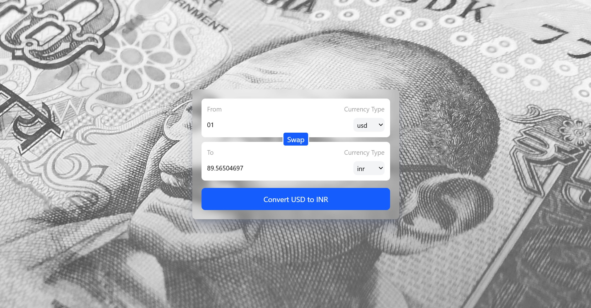

# Currency Converter

This project has been created as a part of a React practice project, and is a currency converter.

The product fetches the latest currency values through an api. Numerous currency options available through the api can be selected using the dropdown menu.

- Project allows swapping of values i.e. from USD->INR to INR->USD
- Amount can be entered in the input labelled "From"
- A Dropdown menu allows selecting different currencies.

