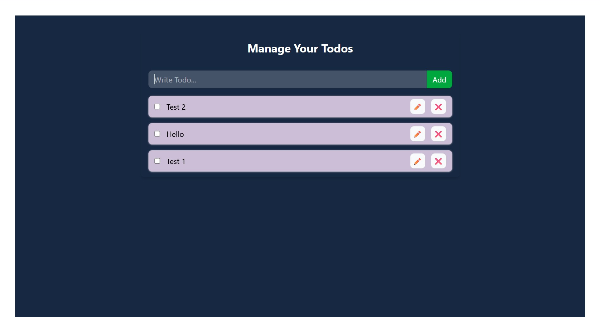
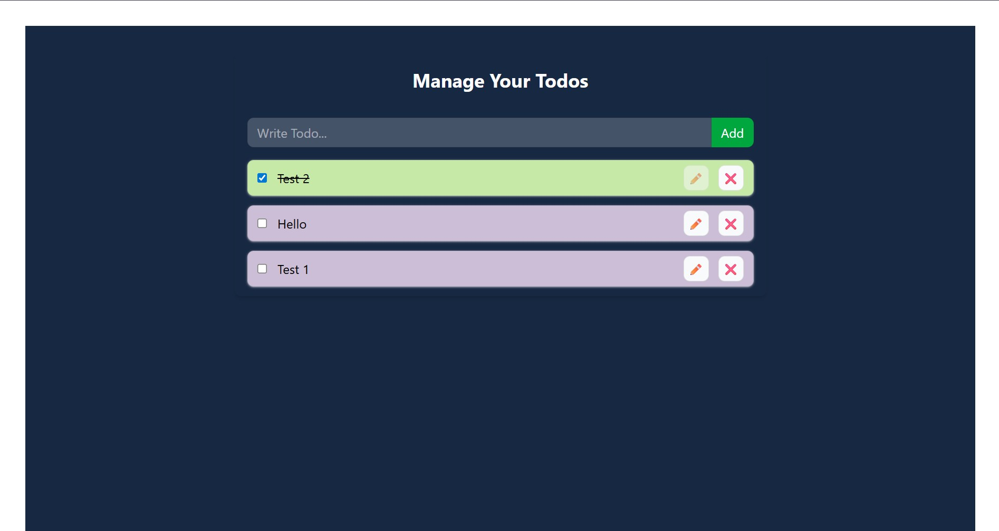

# To-Do List Project:

A To-Do list project using Context API in React and Local Storage to store and fetch list items.

## Highlights of Project:
- Uses package.json for project dependencies and scripts.
- Implemented main App component with Todo management functionality.
- TodoForm component is used for adding new todos.
- TodoItem component is used for displaying and managing individual todos.
- TodoContext is used for state management using React Context API.
- index.js for exporting components and context.

## Screenshots:

### Potential Improvements:
- UI Fixtures
- The application possesses a bug in the editing of tasks. When the user clicks the edit button, and then checks the completed check box, the particular item continues to remain in editing mode, making it possible to edit that specific list item even after being marked as 'completed: true'.